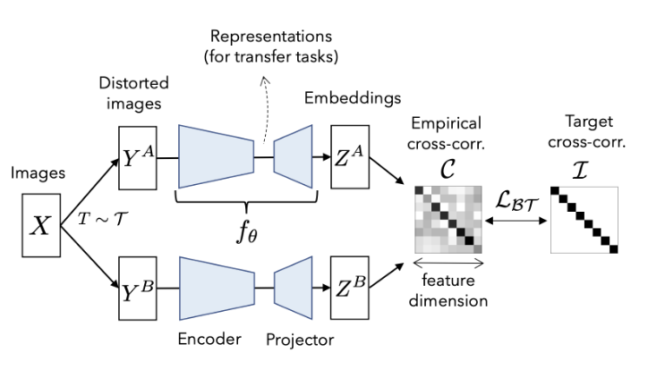
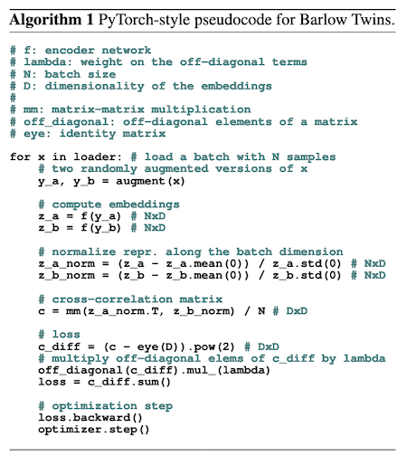

Tags: #machine-learning #paper-review #computer-vision 

["Barlow Twins: Self-Supervised Learning via Redundancy Reduction"](https://arxiv.org/pdf/2103.03230.pdf) by Zbontar et al (2021) uses a novel cross-correlation approach to enforce similarity between embeddings from two distorted crops of the same image.

On [[ImageNet Dataset|ImageNet]], with linear probes, it reaches 73.2% (Top-1) and 91.0% (Top-5), neither of which were SOTA.  With 1% of labels it reaches 55% and 79.2%, and 10% it reaches 69.7% and 89.3%.  On few shot learning (1% of labels), it did beat SOTA by $\lt 1\%$.

Uses a novel loss term that compares the cross-correlation of two embeddings against the identity matrix to enforce similarity of each of the embedding vectors' same components ($i=j$) and dissimilarity between the different ($i \ne j$) components:
$\mathcal{L}_{BT} \overset{\Delta}{=} \underbrace{ \sum\limits_{i}(1-C_{ii})^{2} }_{\rm invariance term}+ \lambda \underbrace{ \sum\limits_{i} \sum\limits_{j \neq i} C_{ij}^{2} }_{\rm redundancy reduction term}$ 

Additional highlights:
- Very simple implementation of the loss function.
- First architecture with symmetric networks that learn simultaneously, rather than asymmetrically or non-differentiably.
- Non-contrastive nature allows it to work with smaller batches ($b=\{128, 256\}$).
- Benefits from large representations in the projector head and is only limited by GPU memory.
- Does result in very large models during training (150M parameters just for projector).  Projector is discarded after training leaving just the backbone, which is typically small (e.g. ResNet-50 with $\approx 26M$ parameters).

# Assessment
Is comparable to both BYOL and SWaV w.r.t. performance in transfer learning performance on classification and detection tasks.  No strong implementation motivation to use Barlow Twins.

Theory: Because of the batch normalization, projectors require large embeddings with dimensionality at least as large as the "concepts" present in the data.  If the dimensionality is too small, then the redundancy reduction loss term will start penalizing things.

$\lambda$ in$\mathcal{L}_{BT}$ should be a function of the projector's dimensionality, but isn't explicitly set as such.  Otherwise $\sum\limits_{i} \sum\limits_{j \neq i} C_{ij}^{2}$ will get big (in a relative sense).  Section 2.2 indicates a hyperparameter search was used for $\lambda$ and settled on $5 \times 10^{-3}$.  No additional discussion was given.

Very similar to VICreg, though Barlow Twins is focused solely on images.
# Model 
The Encoder architecture isn't a focus in the paper, just the overall dual-branched network to align augmented crops from the same image:

ResNet-50 is used for the backbone network.

Implemented as:

Normalization across embedding components in the batch, so that $Z_{i}^{A}$ is $\mathcal{N}(0, 1)$  across the batch.

# Training
Trains 1000 epochs in 124 hours with 32x Tesla V100s, batch size of 2048.  This is slightly slower than BYOL which trains in 113 hours on 32x Tesla V100s, batch size of 4096.

Uses the LARS optimizer.

10 epoch warmup before using cosine decay schedule for learning rate (decreasing by 1000x over the entire time).

## Augmentations
From their [Github implementation](https://github.com/facebookresearch/barlowtwins/blob/main/main.py):

| Augmentation | Probability | Parameters |
| --- | --- | --- |
| Resized Crop | 100% | Rescale the image to scale of XXX, then crop to 224 $\times$ 224 |
| Horizontal Flip | 50% | Horizontal flip |
| Color Jitter | 80% | Adjust (brightness, contrast, saturation, hue) up to $[0.4, 0.4, 0.2, 0.1]$ in each channel |
| Grayscale Conversion | 20% | Convert to grayscale |
| Gaussian Blur | 100% | Blur with kernel $\sigma \in [0.1, 2.9]$ |
| Solarization | 20% | |

# Ablations
Care was taken to identify the key performance factors.  The invariance term must exist, otherwise the model fails to converge.  Independence of components in $Z^{A}$ is the next largest factor.  Both of these make sense since they directly contribute to the diagonal terms compared against the identity matrix.

The method is relatively robust to a range of batch sizes, $b \in \{128, 256, 512, 1024, 2048, 4096\}$, with a spread of 2% on Top-1 accuracy.