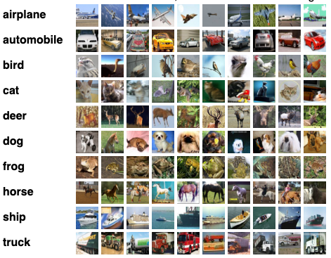

Tags: #ml-dataset #computer-vision

Curated, small color image dataset.  Mutually exclusive with [[CIFAR-100 Dataset|CIFAR-100]].

| Source | Date | Label Types | Samples (Train/Test) | Classes | Commercial Use? |
| --- | --- | --- | --- | --- | --- |
| [Technical Report](https://www.cs.toronto.edu/~kriz/learning-features-2009-TR.pdf) | 2009 | Classes | 60,000 (50,000/10,000) | 10 | Unknown |

# Details
Created by Krizhevsky and Hinton.  From the Canadian Institute for Advanced Research.

## Samples
Tiny, color images are 32x32 pixels big.  6,000 images per class.  Derived from the now defunct [TinyImages](https://groups.csail.mit.edu/vision/TinyImages/) dataset. 5 splits provided for reproducible K-folds.

[]

## Classes
Simple classes:
- Airplane
- Automobile
- Bird
- Cat
- Deer
- Dog
- Frog
- Horse
- Ship
- Truck