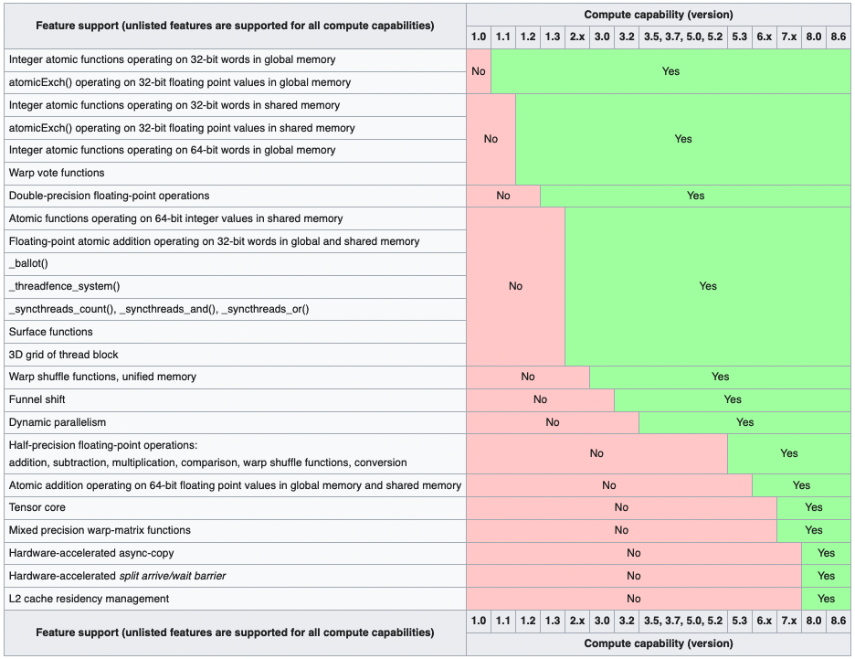

Tags: #cuda #cheatsheet

# Control Visible Devices
Set `CUDA_VISIBLE_DEVICES` before CUDA is initialized, either prior to process launch or within before using CUDA. 

```shell
$ CUDA_VISIBLE_DEVICES= 
```

# Devices
Details on devices regularly encountered:

| Name | Architecture | CUDA Compute | RAM | CUDA Cores | Tensor Cores | RT Cores |
| --- | --- | --- | --- | --- | --- | --- |
| Tesla P100 | Pascal (GP100) | XXX | XXX | 3,584 | - | - |
| Tesla P40 | Pascal (GP102) | 6.1 | 24 GB | 3,840 | - | - |
| Tesla V100 | Volta (GV100) | 7.0 | 16 or 32 GB | 5,120 | 640 | - |
| RTX 2070 | Turing (TU106) | 7.5 | 8 GB | 2,304 | 288 | 36 |
| Ampere A2 | Ampere (GA107) | 8.6 | 16 GB | 1,280 | 40 | 10 |
| Ampere A30 | Ampere (GA100) | 8.0 | 24 GB | 3,584 | 224 | - |
| Ampere A100 | Ampere (GA100) | 8.0 | 40 or 80 GB | 6,912 | 432 | - |


# CUDA Capability
Wikipedia is the best for quick summaries:
- Table of cards and their [CUDA compute capability](https://en.wikipedia.org/wiki/CUDA#GPUs_supported).
- [Hardware features](https://en.wikipedia.org/wiki/CUDA#Version_features_and_specifications) by CUDA compute capability



# CUDA Samples
Building the CUDA samples for a particular architecture cuts down on build time and binary size.  Specify a comma-delimited list of compute capabilities (e.g. CC 7.5 is "75"):
```shell
$ make SMS=70
```