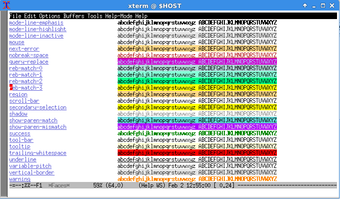
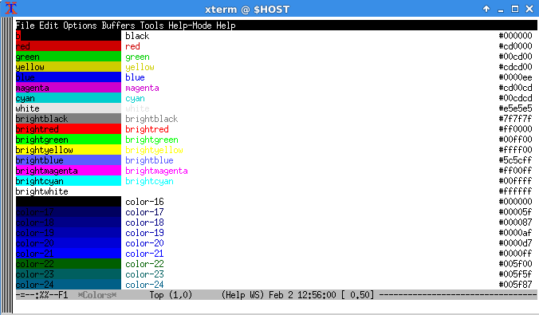
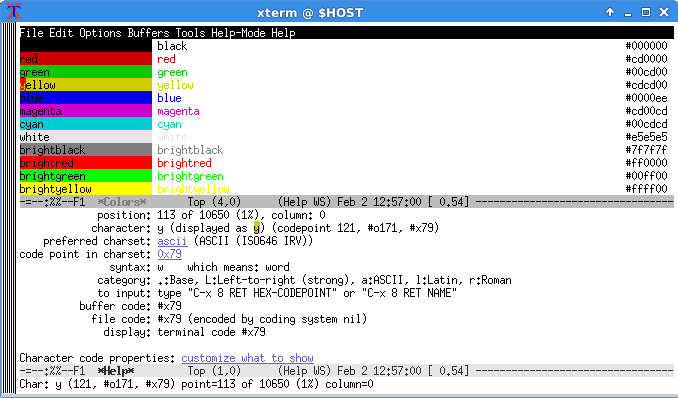

Tag: #emacs #user-configuration 

Customizing faces is relatively straight forward when doing it through Emacs' customization framework, though a bit daunting when attempting to set it up in one's `init.el`.  The basic process is:

- Identify the color scheme desired (querying the current faces, identifying external color palettes, etc)
- (Optional) Define a new face
- Use the selected face

# Querying Faces
A list of all faces currently defined within Emacs can be found via `M-x list-faces-display`.  This is particularly useful for seeing what is available for reuse.

[]

Emacs' current color list can be displayed via `M-x list-colors-display`.

[]

Investigating the color/face at the point can be done with `M-x what-cursor-position`:

[]

# Defining Faces
The simplest face specifies a name, the foreground color, and documentation. More complex faces define foreground and background colors that are tailored to the number of available colors, add them into groups for organization/documentation purposes, and provide additional attributes like reverse video.

Consider this example:

```lisp
  (defface highlight-whitespace
  '((((class color) (min-colors 256) (background light)) :background "#d700d7") ; purple
    (((class color) (min-colors 256) (background dark))  :background "#d700d7")
    (((class color) (min-colors 16)  (background light)) :background "#cd00cd") ; magenta
    (((class color) (min-colors 16)  (background dark))  :background "#cd00cd")
    (((class color) (min-colors 8)   (background dark))  :background "#cd00cd") ; magenta
    (t :inverse-video t))
  "Face for highlighting erroneous whitespace."
  :group 'whitespace)
```

The above creates a new face called `highlight-whitespace` that provides foreground/background colors for 8-bit, 4-bit, and legacy 3-bit environments. This face is highlighted due to the `:inverse-video t` attribute and is part of the `whitespace` group (as defined in  `whitespace.el`).

# Specifying a Face
This should be as straight forward as assigning a face to a particular variable like so:

```lisp
(setq 'some-configurable-face 'highlight-whitespace)
```

Though it is unclear if there is a better way to do this (c.f. `whitespace.el`'s `whitespace-*` variables).