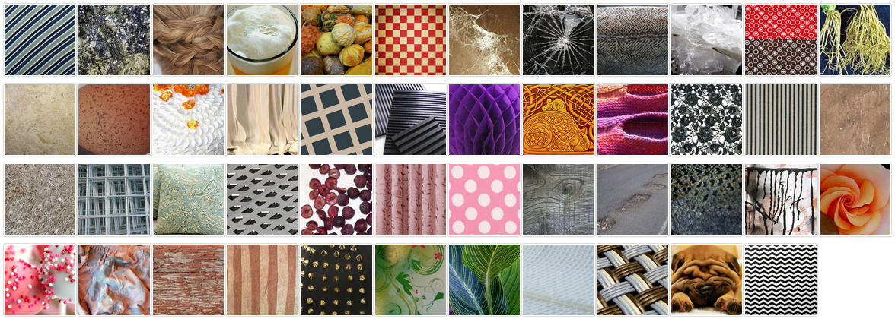

Tags: #ml-dataset #computer-vision 

Small collection of large color images of textures.

| Source | Date | Label Types | Samples (Train/Validate/Test) | Classes | Commercial Use? |
| --- | --- | --- | --- | --- | --- |
| [Paper](https://www.robots.ox.ac.uk/~vgg/publications/2014/Cimpoi14/cimpoi14.pdf), [Homepage](https://www.robots.ox.ac.uk/~vgg/data/dtd/), [Dataset](https://www.robots.ox.ac.uk/~vgg/data/dtd/download/dtd-r1.0.1.tar.gz), [Code](https://www.robots.ox.ac.uk/~vgg/data/dtd/download/desctex.tar.gz) | 2014 | Labels  | 5640 (1,880/1,880/1,880) | 47 | Unknown |

# Details
From the VGG group in Oxford.
## Samples
Large, color images (300x300 to 640x640) with 120 images per category.  At least 90% of each image contains the texture in question.  Category adjectives were selected to minimize co-occurrence so images only have a single class.

[]

## Classes
Adjectives used:
- Banded
- Blotchy
- Braided
- Bubbly
- Bumpy
- Chequered
- Cobwebbed
- Cracked
- Crosshatched
- Crystalline
- Dotted
- Fibrous
- Flecked
- Freckled
- Frilly
- Gauzy
- Grid
- Grooved
- Honeycombed
- Interlaced
- Knitted
- Lacelike
- Lined
- Marbled
- Matted
- Meshed
- Paisley
- Pitted
- Pleated
- Polka-dotted
- Porous
- Scaly
- Smeared
- Spiralled
- Sprinkled
- Stained
- Stratified
- Striped
- Studded
- Swirly
- Veined
- Waffled
- Woven
- Wrinkled
- Zigzagged
