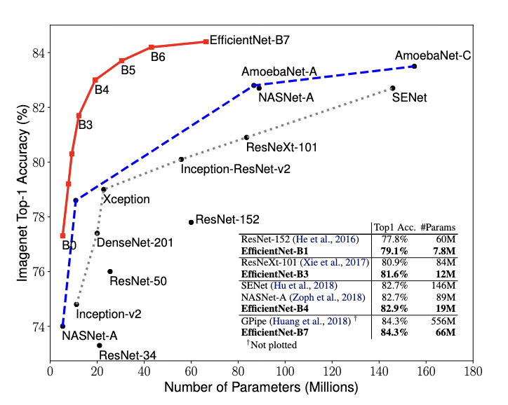

Tags: #computer-vision 

Families of architectures from ["EfficientNet: Rethinking Model Scaling for Convolutional Neural Networks" ](https://arxiv.org/abs/1905.11946v5)by Tan and Le (2020).  8 official architectures (EfficientNet-B0 through -B7) presented in the original work.

Search across candidate architectures by varying:
1. Layer depth (more layers)
2. Layer width (more channels)
3. Larger kernel radius

Search is constrained to respect FLOPS and memory footprint constraints.

Subset of EfficientNet's paper's Table 2:

| Variant | Top-1 Accuracy | Parameter Count | FLOPS |
| --- | --- | --- | --- |
| B0 | 77.1% | 5.3M | 0.39B |
| B1 | 79.1% | 7.8M | 0.7B |
| B2 | 80.1% | 9.2M | 1B |
| B3 | 81.6% | 12M | 1.8B |
| B4 | 82.9% | 19M | 4.2B |
| B5 | 83.6% | 30M | 9.9B |
| B6 | 84.0% | 43M | 19B |
| B7 | 84.3% | 66M | 77B |