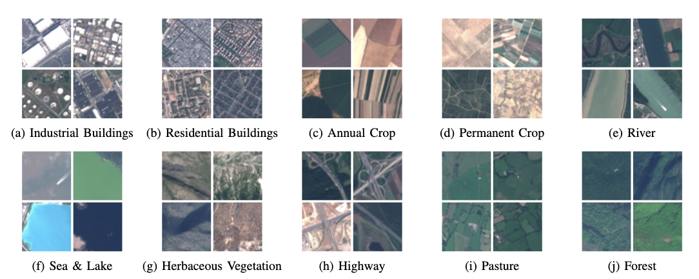

Tags: #ml-dataset #computer-vision 

Curated imagery from the Sentinel-2A satellite comprised of European observations.

| Source | Date | Label Types | Samples | Classes | Commercial Use? |
| --- | --- | --- | --- | --- | --- |
| [Paper](https://arxiv.org/abs/1709.00029), [Data](https://github.com/phelber/eurosat) | 2017 | Classes | 27,000 | 10 | ? |

# Details
64x64 color images from the Sentinel-2A satellite.  See ["EuroSAT: A Novel Dataset and Deep Learning  Benchmark for Land Use and Land Cover  
 Classification"](https://arxiv.org/abs/1709.00029) Section 3 for acquisition details.

# Classes
10 classes with high intra-class variance:
1. Industrial buildings
2. Residential buildings
3. Annual crop
4. Permanent crop
5. River
6. Sea and lake
7. Herbaceous vegetation
8. Highway
9. Pasture
10. Forest

Urban classes include European cities from 34 countries.