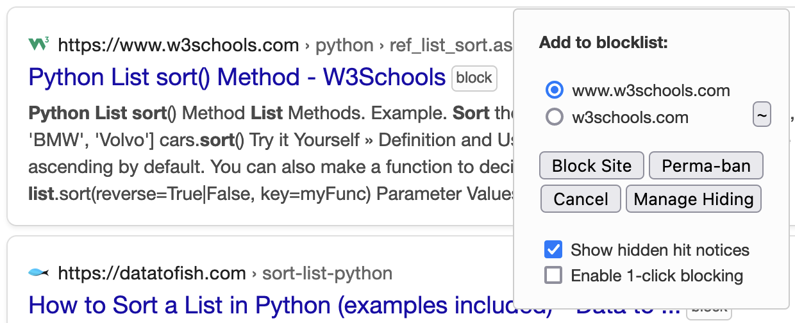

Tags: #firefox #browser-extension 

FireMonkey is a descendant of the original GreaseMonkey extension that allows users to run JavaScript in their browser after webpages have loaded.  This allows arbitrary modifications to the site to fix bugs, remove annoyances, or provide additional functionality that the site will never provide.

[Greasy Fork](https://greasyfork.org/en) is the place to go for user scripts.

# Remove Domains from Search Results

[Google Hit Hider](https://greasyfork.org/scripts/1682-google-hit-hider-by-domain-search-filter-block-sites) prevents domains from showing up in search results.  This allows direct management of search engine optimization (SEO) copy-cat sites as well as sites that are never of interest.

Not specific to Google and supports Duck Duck Go, Bing, and others, as well. 

Adds a "block" button next to results like so:
[]

Blocking sites allows them to show up in search results, though as a minimal (i.e. single line) entry. Perma-ban prevents them from showing up in search results.

[HackerNews discussion about blocking via uBlacklist here](https://news.ycombinator.com/item?id=29546433).  Useful for inspiration.

# Old Reddit is the Best Reddit
[Old Reddit Redirect](https://greasyfork.org/scripts/426731-old-reddit-redirect) redirects all Reddit links to the Old Reddit site (i.e. https://old.reddit.com).  This avoids inline images, the non-sense hidden discussions after the top comment, etc.