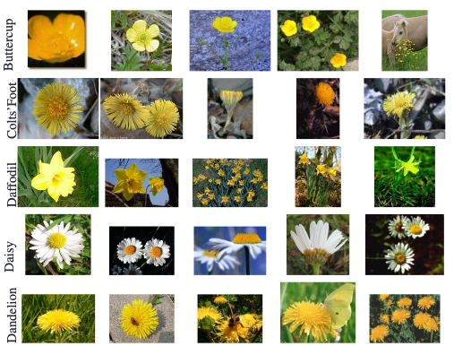

Tags: #ml-dataset #computer-vision 

Small dataset of common British flowers.

| Source | Date | Label Types | Samples (Train/Test) | Classes | Commercial Use? |
| --- | --- | --- | --- | --- | --- |
| [Paper](https://www.robots.ox.ac.uk/~vgg/publications/2006/Nilsback06/), [Homepage](https://www.robots.ox.ac.uk/~vgg/data/flowers/17/index.html), [Dataset](https://www.robots.ox.ac.uk/~vgg/data/bicos/data/oxfordflower17.tar) | 2006 | Labels, BiCoS segmentation | 1,360 (?, ?) | 17 | Unknown |

# Details
From the VGG group in Oxford.
## Samples
Color images of flowers.  Each class has 80 samples chosen so that the class cannot be identified by color alone.

## Labels
Classes and BiCoS segmentations that separate foreground and background.

## Classes
17 species of flowers common to the United Kingdom:
- Buttercup
- Colts' Foot
- Daffodil
- Daisy
- Dandelion
- Gritillary
- Iris
- Pansy
- Sunflower
- Windflower
- Snowdrop
- Lilly Valley
- Bluebell
- Crocus
- Tigerlily
- Tulip
- Cowslip
