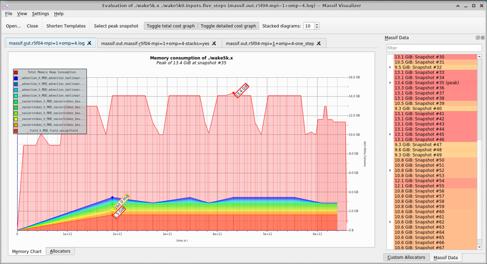

Tags: #utilities #performance 


```shell
valgrind --tool=massif --massif-out-file=massif.out.%p executable arguments ...
```

The collection process is separate from the visualization process, and the log file itself is not intended for human consumption despite being text-based.  See below for interpreting the log file.

# Largest Allocations for Snapshot
For a given snapshot, `N`, this one liner will identify the allocations recorded and print their allocation site:
```shell
# replace the 'N' in the sed call as appropriate.
$ ms_print massif.out.log | sed -n -e '/^ N/,/^$/p' | grep '^->'
->12.17% (1,614,807,040B) 0x140BA5: __field_h_MOD_field_assignfield (Field.f90:48)
->02.06% (272,629,760B) 0x15C3B6: __navierstokes_h_MOD_navierstokes_boussinesqoi (NavierStokes_Boussin_OI.f90:702)
->02.06% (272,629,760B) 0x15C3CB: __navierstokes_h_MOD_navierstokes_boussinesqoi (NavierStokes_Boussin_OI.f90:703)
->02.06% (272,629,760B) 0x15C3DD: __navierstokes_h_MOD_navierstokes_boussinesqoi (NavierStokes_Boussin_OI.f90:704)
->02.06% (272,629,760B) 0x15C3ED: __navierstokes_h_MOD_navierstokes_boussinesqoi (NavierStokes_Boussin_OI.f90:705)
->01.12% (149,094,400B) 0x160F21: __navierstokes_h_MOD_navierstokes_boussinesqoi (NavierStokes_Boussin_OI.f90:901)
...
->01.04% (138,444,800B) 0x1BC015: __advection_h_MOD_advection_nonlineartermsandtransport_overint (Advection_nonlinearAndTr_OI.f90:122)
->01.04% (138,444,800B) 0x1BC045: __advection_h_MOD_advection_nonlineartermsandtransport_overint (Advection_nonlinearAndTr_OI.f90:123)
->00.10% (13,212,175B) in 1+ places, all below ms_print's threshold (01.00%)
```

# Visualizing Heap Allocations

## Console Output - ms_print

```shell
$ ms_print massif.out.12345
    GB
13.39^                                               #
     |                    @@:::::::    ::::@:::  ::::#::::  ::::::@:
     |          ::::::::: @ ::: ::     ::::@::   : : #:: :  :: :: @:     :
     |          :: ::: :  @ ::: ::     ::::@::   : : #:: :  :: :: @:     :
     |          :: ::: :  @ ::: ::     ::::@::   : : #:: :  :: :: @:   :@::
     |          :: ::: :  @ ::: :: @@  ::::@:: : : : #:: :: :: :: @:   :@::@::
     |     ::   :: ::: :  @ ::: :: @   ::::@:: @@: : #:: :  :: :: @:  ::@::@::
     |     :    :: ::: : :@ ::: :: @ ::::::@:: @ : : #:: : ::: :: @:::::@::@::
     | ::::: ::::: ::: : :@ ::: :: @ : ::::@:: @ : : #:: : ::: :: @:: ::@::@::
     | :: :: : ::: ::: : :@ ::: :: @ : ::::@:: @ : : #:: : ::: :: @:: ::@::@::
     | :: :: : ::: ::: : :@ ::: :: @ : ::::@:: @ : : #:: : ::: :: @:: ::@::@::
     | :: :: : ::: ::: : :@ ::: :: @ : ::::@:: @ : : #:: : ::: :: @:: ::@::@::
     | :: :: : ::: ::: : :@ ::: :: @ : ::::@:: @ : : #:: : ::: :: @:: ::@::@::
     | :: :: : ::: ::: : :@ ::: :: @ : ::::@:: @ : : #:: : ::: :: @:: ::@::@::
     | :: :: : ::: ::: : :@ ::: :: @ : ::::@:: @ : : #:: : ::: :: @:: ::@::@::
     | :: :: : ::: ::: : :@ ::: :: @ : ::::@:: @ : : #:: : ::: :: @:: ::@::@::
     | :: :: : ::: ::: : :@ ::: :: @ : ::::@:: @ : : #:: : ::: :: @:: ::@::@::
     | :: :: : ::: ::: : :@ ::: :: @ : ::::@:: @ : : #:: : ::: :: @:: ::@::@::
     | :: :: : ::: ::: : :@ ::: :: @ : ::::@:: @ : : #:: : ::: :: @:: ::@::@::
     | :: :: : ::: ::: : :@ ::: :: @ : ::::@:: @ : : #:: : ::: :: @:: ::@::@::
   0 +----------------------------------------------------------------------->Gi
     0                                                                   613.8
```

## Qt Application - massif-visualizer



# Tracking Small Allocations

The default granularity is to track allocations that are at least 1% of the total heap size to avoid cluttering output (and slowing down the tracking).  If those are of interest, lowering the threshold can be done via the `--threshold=x` option (where `x` is a fractional positive value):

```shell
valgrind --tool=massif --threshold=0.1 --massif-out-file=massif.out.%p executable arguments ...
```
