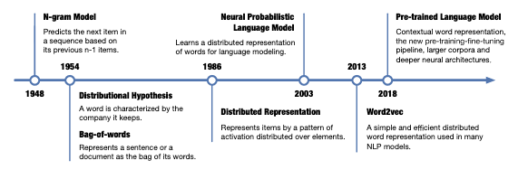

Tags: #machine-learning #nlp 

Collection of facts on how words are mapped to embeddings for use within machine learning models.



# n-grams and Bag-of-Words
Well established techniques from the late 1940's and 1950's.

# Word2vec
Representations of individual words that are computed from context alone, and not a learned representation.  Embeddings come from the local context and not the order, so permutations of word order while preserving the same context will result in the same embedding.

Also called local representations.

["Efficient Estimation of Word Representations in Vector Space"](https://arxiv.org/pdf/1301.3781.pdf) by Mikolov (2013) introduced word2vec, CBOW, and Skip-grams.

GloVe and fastText are other references to review.

## Continuous Bag of Words (CBOW)
Computes a representation from the context.

## Skip-gram
Predicts surrounding words given the current word (XXX: unclear how this works).

# Distributed Representations
Learned representations that takes into consideration the surrounding context.

Typically this is simply a random matrix that is learned during training.  From the PyTorch documentation on [`nn.Embedding`](https://pytorch.org/docs/stable/generated/torch.nn.Embedding.html):

```python
# an Embedding module containing 10 tensors of size 3.
embedding = nn.Embedding( 10, 3 )

# a batch of 2 samples of 4 indices each.
input = torch.LongTensor( [[1, 2, 4, 5], [4, 3, 2, 9]] )
print( embedding( input ) )

# note that the 2nd and 3rd rows of the samples match, indicating that
# the call() interface is an index lookup.
tensor([[[-0.0251, -1.6902,  0.7172],
 [-0.6431,  0.0748,  0.6969],
 [ 1.4970,  1.3448, -0.9685],
 [-0.3677, -2.7265, -0.1685]],

 [[ 1.4970,  1.3448, -0.9685],
 [ 0.4362, -0.4004,  0.9400],
 [-0.6431,  0.0748,  0.6969],
 [ 0.9124, -2.3616,  1.1151]]])
```

While an embedding is simply a matrix, the `nn.Embedding` interface provides index access, normalization, padding, and sparsity controls.