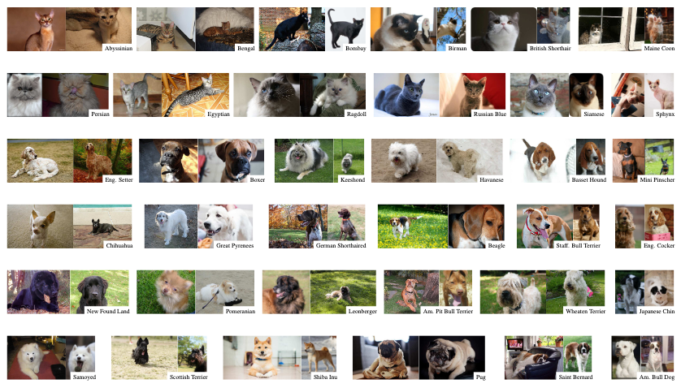

Tags: #ml-dataset #computer-vision

Small curated image collection of cats and dogs with bounding boxes and segmentation masks.

| Source | Date | Label Types | Samples (Train/Test) | Classes | Commercial Use? |
| --- | --- | --- | --- | --- | --- |
| [Paper](https://www.robots.ox.ac.uk/~vedaldi/assets/pubs/parkhi12cat.pdf) | 2012 | Classes, bounding boxes, trimap segmentation | 7,049 (3,680/3,369) | 37 | Unknown |

# Details
From the VGG group at Oxford.

## Samples
Publicly available color images centered on pets.  Reasonable diversity in samples.  Image dimensions are typically at least 200 pixels.

[]

## Labels
Bounding boxes focus on the pet's head.  Trimap segmentation identifies background, foreground, and ambiguous regions.

## Classes
Split up by cats and dogs.

12 types of cats:
- Abyssian
- Bengal
- Bombay
- Birman
- British Shorthair
- Maine Coon
- Persian
- Egyptian
- Ragdoll
- Russian Blue
- Siamese
- Sphynx

25 types of dogs:
- English Setter
- Boxer
- Keeshond
- Havanese
- Basset Hound
- Mini Pinscher
- Chihuahua
- Great Pyrenees
- German Shorthaired
- Beagle
- Stafford Bull Terrier
- English Coker
- New Found Land
- Pomeranian
- Leonberger
- American Pit Bull Terrier
- Wheaten Terrier
- Japanese Chin
- Samoyed
- Scottish Terrier
- Shiba Inu
- Pug
- Saint Bernard
- American Bull Dog
