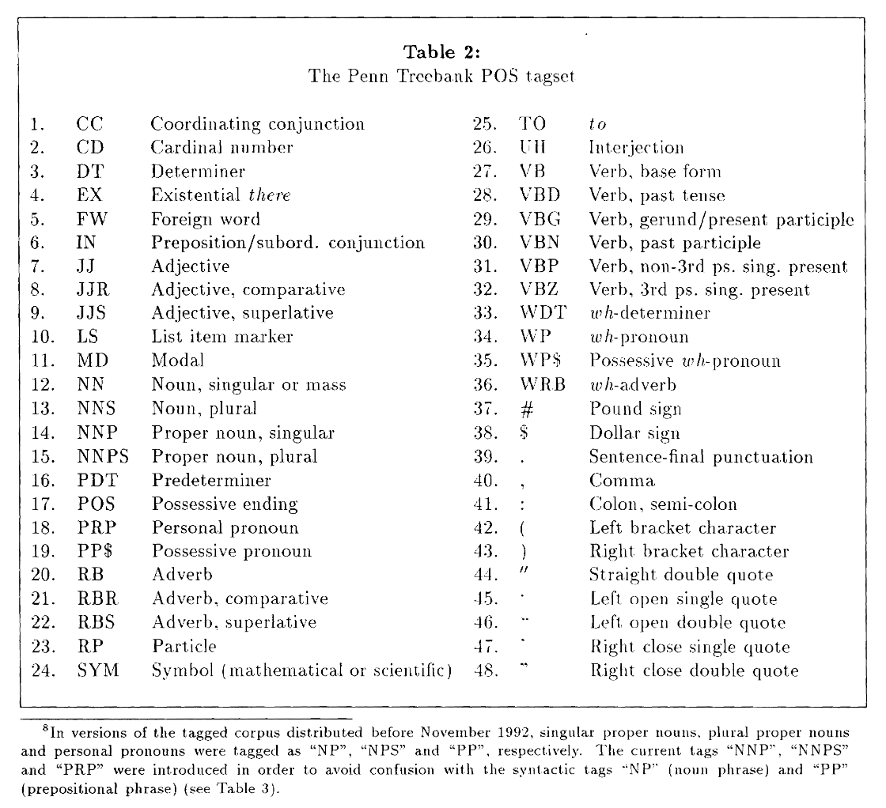
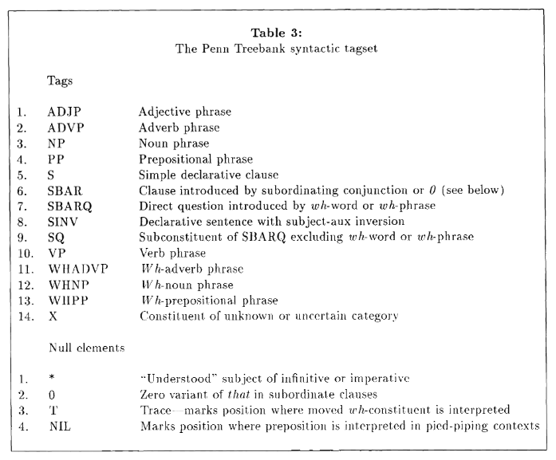

Tags: #machine-learning #nlp #ml-dataset 

"Large" dataset from early 1990's that has part-of-speech (POS) and skeletal syntactic structure labels.  

| Name |Source | Date | Languages | Label Types | Samples (Train/Test) | Classes | Commercial Use? |
| --- | --- | --- | --- | --- | --- | --- | --- |
| Penn Treebank | [Paper](https://repository.upenn.edu/cgi/viewcontent.cgi?article=1246&context=cis_reports) | 1993 | English | Part-of-speech, syntactic structure | ~4.5M words | Unknown | 

# Details
Collection of multiple disparate English corpuses that were all tagged for [[Part-of-Speech (POS) Tagging|part-of-speech (POS)]] and half tagged for skeletal syntactic structure. 

## Samples
4.5M English words across 9 disparate corpora:
1. Department of Energy abstracts
2. Dow Jones Newswire stories 
3. Department of Agriculture bulletins
4. Library of America text
5. MUC-3 messages
6. IBM Manual sentences
7. WBUR radio transcripts
8. ATIS sentences
9. Brown Corpus, retagged

The Down Jones Newswire stories are colloquially known as the Wall Street Journal (WSJ) section and comprises of roughly 65% of the corpus with 3M words.

# Classes

## Part-of-Speech Tags
All 4.5M words have POS tags. See the [[Part-of-Speech (POS) Tagging#Penn Treebank POS Tagset|Penn Treebank POS tagset]] for details.

## Syntactic Tags

Roughly half of the dataset (~2M words) have syntactic tags.

