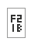

Tags: #privacy #firefox

All of the following should have automatic updates and be allowed to run in Private Windows.

# Firefox Multi-Account Containers
No settings to configure.

Create the containers as appropriate for browsing habits and paranoia level.
# CanvasBlocker
Alter JavaScript APIs to prevent fingerprinting of the local system.

Take the defaults.
# Decentraleyes
Caches resources hosted on content delivery networks (CDN) on the local computer to limit their ability to track.

## Preferences
Check the following:
- Display injection counts on icon
- Disable link prefeching
- Strip metadata from allowed requests

# Privacy Badger
Don't enable auto-learning (this is disabled by default) since it raises the risk of de-anonymizing the browser instance.

## General Settings
Check the following:
- Show count of trackers
- Show websites the "Global Privacy Control" and "Do Not Track" signals
    - Check if third-party domains comply with EFF's Do Not Track Policy
- Prevent sites from tracking which links you click ("hyperlink auditing")
- Disable prefetching
# uBlock Origin
## Settings
Check the following:
- Hide placeholders of blocked elements
- Show the number of blocked requests on the icon
- Make use of context menu where appropriate
- Disable pre-fetching
- Disable hyperlink auditing
- Block CSP reports
- Uncloak canonical names
- Block remote fonts (maybe, this results in some pages showing unicode placeholders like this [])