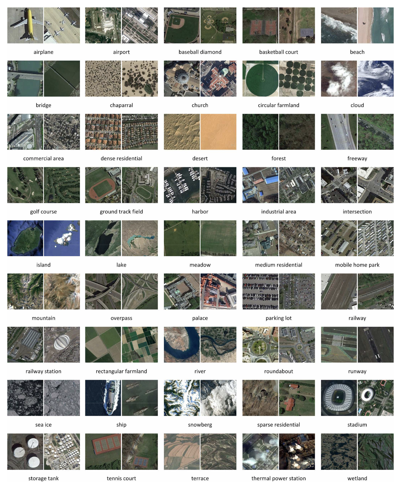

Tags: #ml-dataset #computer-vision 

REmote Sensing Image Scene Classification (RESISC) dataset created by Northwestern Polytechnical University.  Large class count with significant samples per class.

| Source | Date | Label Types | Samples | Classes | Commercial Use? |
| --- | --- | --- | --- | --- | --- |
| [Paper](https://arxiv.org/abs/1703.00121) | | Classes | 31,500 | 45 | Yes? |

# Details

# Samples
Images are sized 256x256 and have varying spatial resolutions ranging from 0.2 to 30m per pixel for everything except large land classes (island, lake, mountain, and snowberg).

# Classes
45 classes with 700 images per class:
- airplane
- airport
- baseball diamond
- basketball court
- beach
- bridge
- chaparral
- church
- circular farmland
- cloud
- commercial area
- dense residential
- desert
- forest
- freeway
- golf course
- ground track field
- harbor
- industrial area
- intersection
- island
- lake
- meadow
- medium residential
- mobile home park
- mountain
- overpass
- palace
- parking lot
- railway
- railway station
- rectangular farmland
- river
- roundabout
- runway
- sea ice
- ship
- snowberg
- sparse residential
- stadium
- storage tank
- tennis court
- terrace
- thermal power station
- wetland