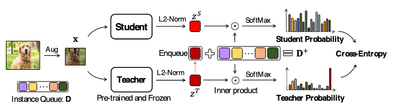
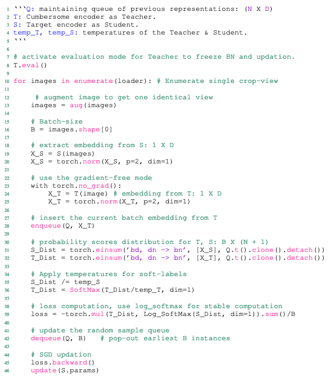

Tags: #machine-learning #paper-review 

["SEED: Self-supervised Distillation for Visual Representation"](https://arxiv.org/abs/2101.04731v2) by Fang et al (2021), published at [[International Conference on Learning Representations (ICLR)|ICLR 2021]].  It presents an unsupervised technique to distill a student from a pre-trained teacher allowing creation of small models with high performance.  A collaboration between Arizona State University and Microsoft.

Works to address the fact that you can't directly use small models for pre-training.  Applying ResNet-18 or [[EfficientNet|EfficientNet-B1]] to SimCLRv2 does not result in a performant model.

Takes an augmented crop of an image and enforces alignment of representations by forcing the student to match the teacher's output.  The novelty is maintaining a queue of previous teacher outputs and computing a self-similarity score for the current sample against the queue entries, that includes the current sample.  Since only the current sample should match, there is a simple target signal that the student should learn.

Highlights:
- Measures k-NN performance (majority label from $K=10$ neighbors) as well as Top-1 and Top-5 accuracies.
- Demonstrated to work with both classification, object detection tasks and segmentation tasks.
- Does not matter how the teacher was trained (with the exception that the data augmentations used there must be replicated during distillation).  Said differently, the student and teacher architectures can differ - train with a very large and data hungry network, then distill into a mobile-friendly network.
- Measured performance for EfficientNet-B0, EfficientNet-B1, MobileNet-v3, ResNet-18, and ResNet-34
- Queue size impacts performance, but not dramatically (2% change from 128 to 64K, $\lt 1\%$ between 512 and 64K).

# Assessment
Bigger teacher models result in better student performance.

Straight forward approach, both conceptually and as an implementation.

Augmentations performed during teacher training need to match those used during the distillation process, otherwise you wander into undefined territory.

# Algorithm

Overview:
1. Select a sample and augment it
2. Generate an embedding from both the student and teacher networks, $Z^{S}$ and $Z^{T}$, respectively
3. Normalize the embeddings with an L2-norm
4. Enqueue $Z^{T}$ into the queue ($D^{+}$)
5. Compute similarity scores against the queue for both the student and teacher's embedding, then compute the softmax for the similarities
6. Compute cross-entropy loss between the softmaxed similarities assess alignment between student and teacher

Psuedo-code for the algorithm:

# Augmentations Used
| Augmentation | Probability | Parameters |
| --- | --- | --- |
| Resized Crop | 100% | Rescale the image to scale of $[0.2, 1.0]$, then crop to 224 $\times$ 224 |
| Color Jitter | 80% | Adjust brightness up to $[0.4, 0.4, 0.4, 0.1]$ in each channel |
| Grayscale Conversion |  20% | Convert to grayscale |
| Gaussian Blur | 50% | Blur with kernel $\sigma \in [0.1, 0.2]$ |
| Horizontal Flip | 50% | Horizontal flip |

