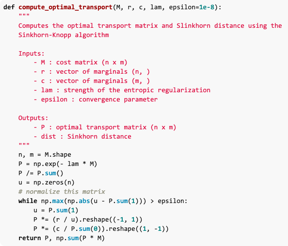
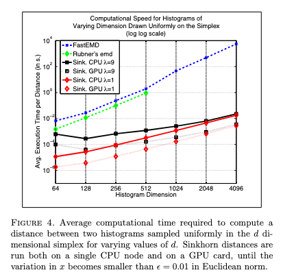

Tags: #machine-learning #paper-review

["Sinkhorn Distances: Lightspeed Computation of Optimal Transportation Distances"](https://arxiv.org/abs/1306.0895) by Cuturi (2013) provides a very fast implementation of the Sinkhorn-Knopp algorithm that is amenable to GPU acceleration.  This makes the use of [[Optimal Transport|optimal transport]] possible within online algorithms.

Highlights:
- Iterative algorithm, though gets *VERY* good results with small iteration counts ($\le 3$), sometimes only a single iteration
- Scales as $O(d^{2}N)$ to compute a family of $N$-many $d$-dimensional histograms.  For reference, Mahalanobis distance computation is $O(d^{3} \log d)$.

The Sinkhorn-Knopp "algorithm" is from "Concerning nonnegative matrices and doubly stochastic matrices." in 1967.

The algorithm is very simple:
1. For a given $M$, $\textbf{r}$ (constraints), $\textbf{c}$ (resources), and $\lambda$ (how soft the constraints are, $\lambda \rightarrow \infty$ means hard), initialize $P_{\lambda} = e^{-\lambda M}$
2. Repeat until convergence or iteration count exceeded
    1. Scale the rows so the row sums match $\textbf{r}$
    2. Scale the columns so the column sums match $\textbf{c}$

[Michiel Stock's blog post](https://michielstock.github.io/posts/2017/2017-11-5-OptimalTransport/) has Python code:

For large $d$, this implementation is $O(10^{6})$ faster than previous approaches:
