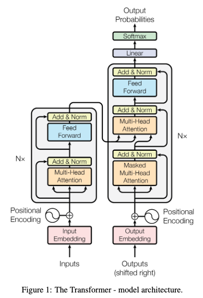
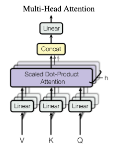
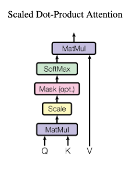

Tags: #machine-learning 

Replaced the use of recurrent networks in NLP tasks after its introduction in [[Attention is All You Need|"Attention is All You Need"]] in 2017.  Key improvements include:

1. Sequence processing is done in parallel, rather than sequentially.
2. Multi-head attention is computationally efficient (c.f. big matrix-multiplications)
3. Supports interaction between symbols separated by arbitrary lengths.

# Architecture

Transformers transform a sequence of inputs into a sequence of outputs, therefore the architecture has an Encoder and a Decoder.  

## Input and Output Blocks
Both input and output are stacks of blocks (like ResNet).  Each block's sublayer is connected via residual connections, which ultimately forces the embedding size to remain constant within each block (and, ultimately, all blocks).

Dropout can be applied to the residual connections.

Multiple attention heads generate a portion of the overall embedding and are concatenated together.

### Input Blocks
N-many blocks of two sub-layers:
1. Multi-Head Attention
2. Fully connected

### Output Blocks
M-many blocks of three sub-layers:
1. Masked Multi-Head Attention on output embedding
2. Multi-Head Attention on #1 and output embedding
3. Fully connected

## Multi-Head Attention Block
Each attention head is comprised of three learned parameters that compute a sub-embedding that is concatenated together and projected.  Since the embedding dimensionality must remain constant, the sub-embedding dimensionality is $d_{embedding_{head}} = d_{embedding} / N_{heads}$.

Attention is simply softmax applied to scaled-dot product and is defined as:

Attention$(Q, K, V)=$ softmax$(\frac{QK^{T}}{\sqrt{d_{k}}})V$

The scaled dot-product is defined as:

Scaling is required to balance large dot product magnitudes stemming from large input vectors.  For variables $q$ and $k$ with $\mu = 0$ and $\sigma^{2} = 1$, their dot product $<q, k>=\Sigma_{i}^{d_{k}} q_{i}k_{i}$ has $\mu = 0$ and $\sigma^{2} = d_{k}$. The authors believe this pushes the softmax function into regions with very small gradients, so by scaling $QK^{T}$ by $\frac{1}{\sqrt{d_{k}}}$ maintains unity variance and keeps softmax in a stable regime.

# Position Encoding
Position of each symbol in the sequence is encoded into the data itself, typically by summation.

The position embedding can be learned, though the original [[Attention is All You Need|"Attention is All You Need"]] paper showed that it did not affect the results, for good or bad.

Clever choice of position embedding scheme can allow a model to train at one "resolution" and then be used at another.  The symbol size remains the same (so that embeddings mean the same thing) but the sequence that the symbols are drawn from changes.  This change between train and use is possible by interpolating the position encoding symbol and was suggested by [[An Image is Worth 16x16 Words - Transformers for Image Recognition at Scale#Position Encoding|"An Image is Worth 16x16 Words: Transformers for Image Recognition at Scale"]].
