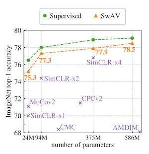
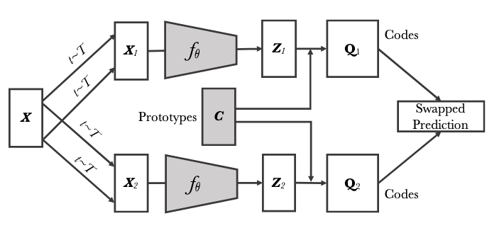
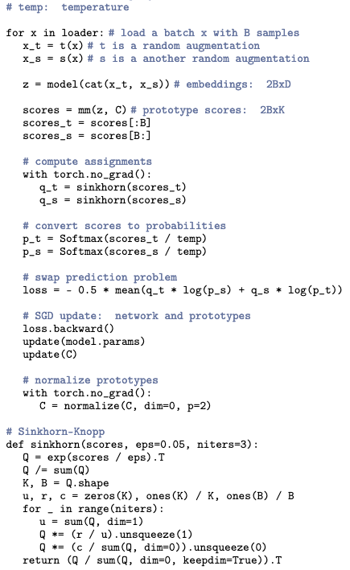

Tags: #paper-review #machine-learning #computer-vision 

["Unsupervised Learning of Visual Features by Contrasting Cluster Assignments"](https://arxiv.org/abs/2006.09882v5) by Caron et al (2021), also known as *Sw*apping *A*ssignments between multiple *V*iews (SWaV).  First unsupervised technique to beat supervised training SOTA with a linear probe on ImageNet.

Takes two augmented crops from the same image and then learns to align their embeddings by predicting on embedding from the other.

Highlights:
- Introduces `multi-crop`, using a mixture of crop resolutions, as an augmentation strategy.
- Avoids collapse by computing embedding prototype (cluster centers) online by using [[Optimal Transport|optimal transport]] ([[Sinkhorn Distances - Lightspeed Computation of Optimal Transport Distances|enabled by GPU acceleration]]) to prevent the trivial solution. 
- Performs very well with "small" batches, $b=256$.
- Can be trained on a reasonable amount of GPUs and time, 200 epochs in 4 days (102 hours) on 4x Tesla V100s.
- Maintains a queue of the previous 3,840 embeddings (15 batches of size 256).  The queue is not utilized until 15 epochs in so that embeddings have settled, otherwise convergence is not guaranteed.
- Code and pre-trained models are [available](https://github.com/facebookresearch/swav). Code is licensed CC-BY-SA-4.0.
- Out performs SimCLRv1 on most fronts - training time and accuracy after pre-training.

Open questions:
- What is the intuition of how the codes evolve over training?
- How large do the smaller crops in `multi-crop` need to be?  Presumably too small causes problems during training.

# Computing Online Codes
**NOTE:** This is where the magic happens.

Codes, $q \in \textbf{Q}$ are computed online such that every prototype has an equal number of samples from the batch assigned to it via optimal transport.  Computing $\textbf{Q}$ is akin to optimizing the following: $\max \limits_{\textbf{Q} \in \mathcal{Q}} Tr(\textbf{Q}^T \textbf{C}^T \textbf{Z}) + \epsilon H(\textbf{Q})$.  Instead of computing $\textbf{Q}$, a continuous version, $\textbf{Q}^{*}$ is solved via Sinkhorn-Knopp, such that $\textbf{Q}^{*} = Diag(\textbf{u}) exp(\frac{\textbf{C}^{T} \textbf{Z}}{\epsilon}) Diag(\textbf{v})$ using 3 iterations.

Computing $\textbf{Q}^{*}$ is fast - $\approx 4,000$ features can be mapped to $3,000$ codes in 35 ms via GPU-accelerated matrix-multiplications.  Matrix normalization statistics ($Diag(\textbf{u})$, and $Diag(\textbf{v})$) must be shared in a distributed setting, though these are significantly smaller than sharing large numbers of features as required by contrastive methods (e.g. SimCLRv1).

[Avoiding mode collapse is not guaranteed](https://github.com/facebookresearch/swav#the-loss-does-not-decrease-and-is-stuck-at-lnnmb_prototypes-8006-for-3000-prototypes). Unclear if this has been addressed since publication.  Appendix A.1 indicates they froze the prototypes after the first epoch was completed.

# Predicting Swapped Views
Given two image features $z_{t}$ and $z_{s}$ from two different augmentations of the same image, codes $q_{t}$ and $q_{s}$ are computed from the online prototypes ($K$ prototypes in $\{c_{1}, c_{2}, ..., c_{K}\}$).  Each feature attempts to predict the others code:

The assumption is that different portions of the input sample should represent the same concepts and, therefore, have similar enough (same?) embeddings.  

# Implementation
The architecture itself is simple and straight forward.

## Hyperparameters
Temperature $\tau = 0.1$. Sinkhorn regularization $\epsilon = 0.05$. Weight decay set at $10^{-6}$.  LARS optimizer.

Learning rate of 4.8 linearly ramped up in 10 epochs.  Cosine decay schedule that finalized at 0.0048.

# Augmentations
**NOTE:** Crop resolutions are always divisible by 32 pixels to avoid rounding in ResNet-50 pooling layers.

| Augmentation | Probability | Parameters |
| --- | --- | --- |
| Resized Crop (full) | 100% | Rescale the image to scale of $[0.14, 1.0]$, then resize to 224 $\times$ 224 |
| Resized Crop (small) | 100% | Rescale the image to scale of $[0.05, 0.14]$, then resize to 96 $\times$ 96 |
| Horizontal Flip | ? | Can't tell from the paper itself |
| Color Jitter | 80% | Adjust (brightness, contrast, saturation, hue) up to [0.8, 0.8, 0.8, 0.2] in each channel |
| Grayscale Conversion | 20% | Convert to grayscale |
| Gaussian Blur | 50% | Blur with kernel $\sigma \in [0.1, 2.0]$ |

## Multi-Crop
Mixes crops of two different sizes, one is "standard" and the other is smaller.  Lower resolution images is done to reduce/eliminate the compute cost while increasing the samples to align.