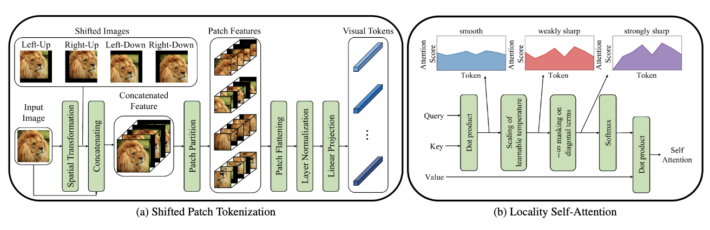

Tags: #paper-review #machine-learning #computer-vision #unfinished 

["Vision Transformer for Small-Size Datasets"](https://arxiv.org/abs/2112.13492v1) by Lee, Lee, and Song (2021) aims to identify modifications to the original [[An Image is Worth 16x16 Words - Transformers for Image Recognition at Scale|Vision Transformer (ViT)]] that allow them to train on small datasets from scratch.  Adds 2-4% onto existing transformer architecture Top-1 accuracy on [[ImageNet Dataset|Tiny ImageNet]].

[PyTorch implementation](https://github.com/aanna0701/SPT_LSA_ViT) by the authors.  No license provided.

Highlights:
- EfficientNet B0 has the best accuracy on Tiny Imagenet (66.8%), which beats the best transformer [CaiT](https://arxiv.org/abs/2103.17239) (64.5%) and its modified SPT-LSA version SL-CaiT (67.2%).
- Providing additional spatial context has a benefit, as does preventing self-attention.

Questions prior to finishing the paper:
- How do they assess that self-attention on CLS is problematic?
- What are the contributions of SPT and LSA?  Table 1 implies insensitivity to Query-Key scaling ($\lt 0.5\%$, sets a bound for learned temperatures) and the ablations in Section 4.2.2 indicate that diagonal masking carries the load (learning temperatures yields $\approx 0.21\%$).

# Novel Contributions

## Shifted Patch Tokenization
Creates a stack of shifted input images (up-left, up-right, down-left, down-right, original) and then partitions into patches as before.  The embedding process now flattens, normalizes, and projects to create an embeddings that now have spatial context incorporated.

Section 3.1 discusses the size of a Vision Transformer's receptive field in relation to ResNet-50 (ViT/16 is roughly 30x smaller, 16 vs 483).

Supplementary material discusses shift directions (cardinal vs diagonal) and intensity (how far). Table 1 indicates that performance marginally depends on the underlying dataset, though is ultimately $\lt 0.3\%$ accuracy.  Table 2 indicates that smaller datasets are more sensitive to the shift intensity and having overlap between patches is key.  Shifting by $\le 50\%$ is best.  

## Locality Self-Attention
The temperature parameter, $\tau$, is learned so that the softmax distribution of the self-attention block is sharper.

Additionally, the the ability to self-attend is removed by masking out the diagonal of the similarity matrix computed by the Query and the Key.  

Attention$(Q, K, V)=$ softmax$(\frac{QK^{T}}{\sqrt{d_{k}}})V$
Locality Attention$(Q, K, V)=$ softmax$(\frac{M \times QK^{T}}{\sqrt{d_{k}}})V$ where $M$ has its diagonals set to $-\infty$.

Scaling the scaled dot-product by $1/\sqrt{ d_{k} }$  also acts as a high temperature which smooths the attention score distribution.