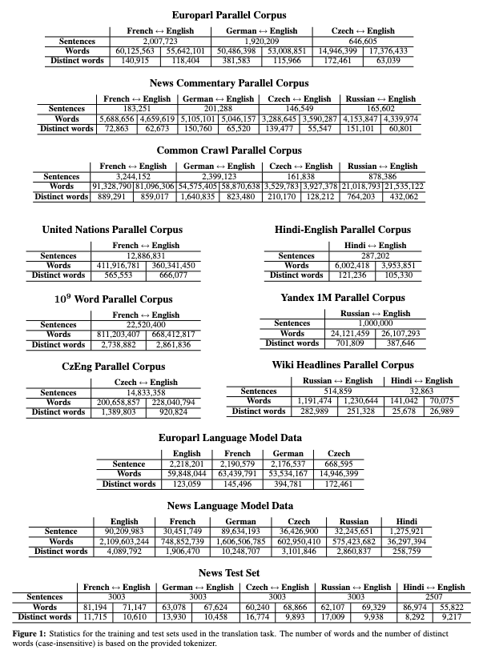

Tags: #machine-learning #nlp #ml-dataset 

Collection of moderately large corpora of sentence translations.  Dataset used to demonstrate the [[Transformer Architecture|Transformer architecture]] in [[Attention is All You Need|"Attention is All You Need"]].

| Name |Source | Date | Languages | Label Types | Samples (Train/Test) | Classes | Commercial Use? |
| --- | --- | --- | --- | --- | --- | --- | --- |
| WMT 2014 | [Paper](https://aclanthology.org/W14-3302.pdf) | 2014 | English, French, German, Czech, Russian, Hindi | Sentence translation | Millions of sentences | Unknown | 

# Details
Corpora were used for four official tasks:
1. Translation task
2. Quality estimation task
3. Metrics task
4. Medical translation task

First year to introduce Hindi as a source language.

## Samples
Comprised of multiple corpora:
- Europarl - Parallel and Language
- News - Commentary, Language and Test set
- Common Crawl
- United Nations
- $10^9$ Word
- CzEng
- Hindi-English
- Yandex 1M
- Wiki Headlines

The smallest corpus has 10's to 100's of thousands of sentences.  The largest have 10-20 millions of sentences.

["Findings of the 2014 Workshop on Statistical Machine Translation"](https://aclanthology.org/W14-3302.pdf) Figure 1:

