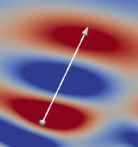

Tags: #iwp-detection

Waves are tiny perturbations of density in a medium.  May be indirectly be visualized by horizontal divergence (`divh`) and potentially other field variables (e.g. density or temperature).

Identification depends on the waves' location relative to the [[Turbulent Wakes]]. 
 Three areas of note:
1. At wake edge (< 1D): Ill-defined waves with non-linear interactions.  Wave signatures may not be clear.
2. Nearfield (1-2D): Waves are sorting themselves out (both well- and ill-defined waves present).  Different wave lengths propagate at different group velocities.
3. Farfield (> 2D): Well-defined waves.

Characteristics to look for:
1. Wavelengths in the range of $[0.5D, 4D]$.  Range will be narrowed depending on the simulation's Re and Fr parameters.
2. Parallel isophase lines of alternating signs.  Red-blue-red pattern (depending on colormap...).
3. Wave width is at least on wavelength.
4. Azimuth in the range of $[50\degree, 60\degree]$ relative to wake center line.  Depends on the simulation's Re and Fr parameters.
5. Elevation in the range of $[30\degree, 60\degree]$ relative to wake center line.  Depends on the simulation's Re and Fr parameters.

Example: late-time, far-field wave (R5F04, Nt=040, z/D=7.46, horizontal divergence)
[]

        